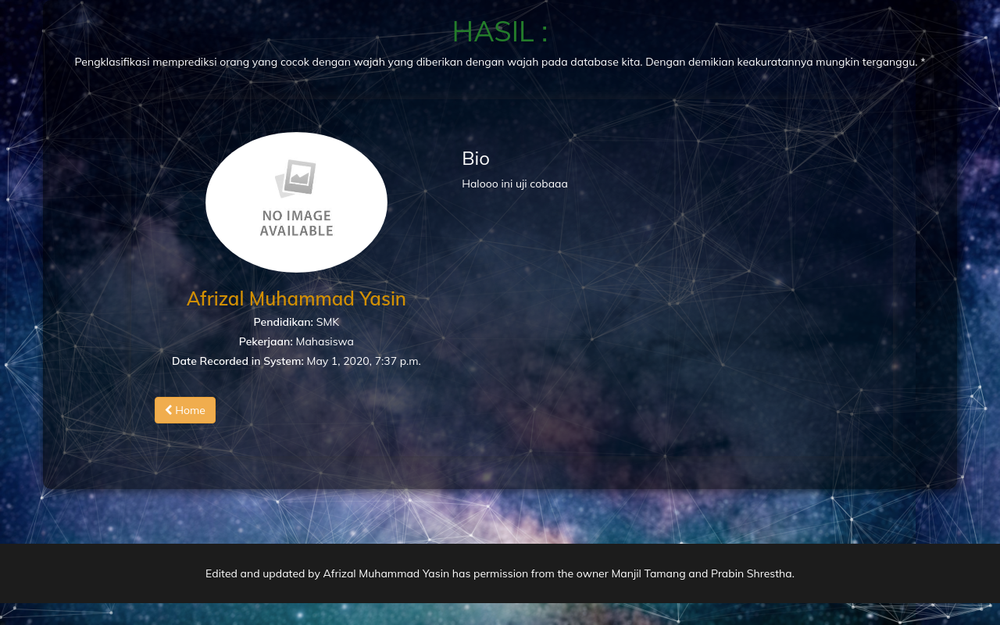

<p align="right">
بِسْــــــــــــــمِ اللَّهِ الرَّحْمَنِ الرَّحِيم 
</p>

# Deteksi wajah dengan Python Django
Projek ini adalah hanya mengupdate versi terbaru dari web framework Django-nya dan beberapa library pendukung.


## Installation

Buat virtualenv terlebih dahulu
```bash
virtualenv {nama_virtual}
```
Masuk kedalam virtual
```bash
source {nama_virtual}/Scripts/activate
```
Jika menggunakan linux
```bash
virtualenv -p python3 {nama_virtual} ##untuk python3, ubuntu biasanya menggunakan ini
cd {nama_virtual}
source bin/activate
```
Install requirements menggunakan [pip](https://pip.pypa.io/en/stable/).
```bash
pip install -r requirements.txt
```
Buat database di phpmyadmin / sejenisnya dengan nama database django_project <br>
Lalu buka terminal, jalankan dengan perintah
```bash
python manage.py migrate && python manage.py runserver --nothreading
```
## Screenshot <br>
 <br>
 <br>
[Demo Video](https://www.youtube.com/watch?v=p70srlZvyvQ&feature=youtu.be)

## Thanks to <br>
[manjillama](https://github.com/manjillama/)
